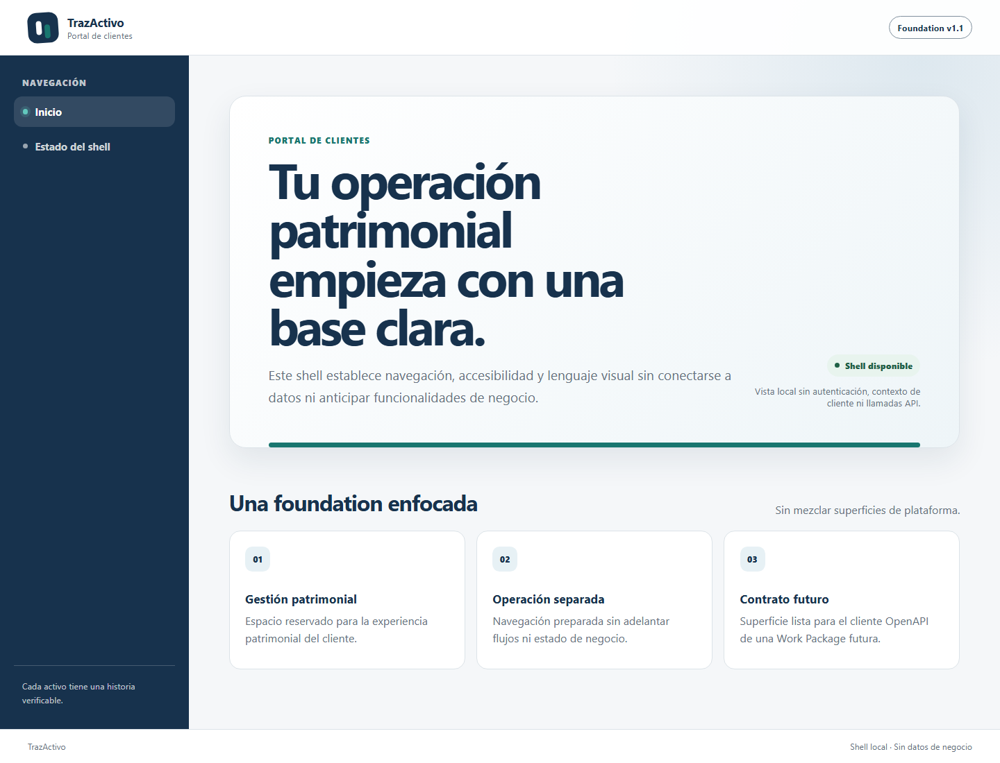

# FND-002 — Reporte de implementación

## Resultado

FND-002 entrega dos shells Next.js independientes para el portal de clientes y TrazActivo Control,
además de la creación inicial mínima de `packages/design-system`. Los shells incorporan navegación,
estados loading/error, smoke visual, tokens aprobados y controles de accesibilidad sin anticipar
autenticación, contexto de cliente, APIs, persistencia ni lógica de negocio.

- Work Package: `FND-002-nextjs-shells`.
- Estado de entrada: `READY`.
- Branch: `codex/FND-002-nextjs-shells`.
- Base: `architecture/v1.1-typescript`.
- Dependencia satisfecha: FND-001 (`DONE`).
- Owner inicial de `packages/design-system`: exclusivamente FND-002.

No se implementó FND-003, FND-004, FND-005 ni otra Work Package.

## Objetivo cumplido

- `portal-web` y `control-web` son workspaces, procesos y builds separados.
- Cada shell ofrece navegación mínima, ruta `/health`, estado loading y error seguro.
- `packages/design-system` expone sólo tokens, estilos y componentes requeridos por los shells.
- Portal no muestra navegación del Control Plane y Control no muestra navegación del portal.
- No existen llamadas API, Prisma, DTO internos, connection strings ni estado de negocio.
- Las suites reales de componente, arquitectura y accesibilidad están integradas al contrato raíz.
- El typecheck de ambos shells es reproducible desde un checkout limpio mediante `next typegen`,
  sin depender de un `.next` previo, `next dev` o `next build`.

## Archivos creados o modificados

### Shell del portal

- `apps/portal-web/package.json`, `next.config.ts` y `tsconfig.json`.
- `apps/portal-web/next-env.d.ts` se retiró de Git; Next.js lo genera y `.gitignore` lo excluye.
- `apps/portal-web/AGENTS.md` y `CLAUDE.md`, generados por Next.js para su documentación local.
- `apps/portal-web/app/layout.tsx`, `page.tsx`, `loading.tsx`, `error.tsx` y
  `app/health/page.tsx`.
- `apps/portal-web/vitest.config.ts`, `vitest.a11y.config.ts` y `tests/*`.

### Shell de Control

- `apps/control-web/package.json`, `next.config.ts` y `tsconfig.json`.
- `apps/control-web/next-env.d.ts` se retiró de Git; Next.js lo genera y `.gitignore` lo excluye.
- `apps/control-web/AGENTS.md` y `CLAUDE.md`, generados por Next.js para su documentación local.
- `apps/control-web/app/layout.tsx`, `page.tsx`, `loading.tsx`, `error.tsx` y
  `app/health/page.tsx`.
- `apps/control-web/vitest.config.ts`, `vitest.a11y.config.ts` y `tests/*`.

### Design system mínimo

- `packages/design-system/package.json`, `tsconfig.json` y `tsconfig.build.json`.
- `packages/design-system/src/index.ts`, `tokens.ts`, `app-shell.tsx`, `states.tsx` y
  `styles.css`.
- `packages/design-system/vitest.config.ts`, `vitest.a11y.config.ts` y `tests/*`.

### Toolchain, límites y documentación

- `.gitignore`, `package.json` y `package-lock.json`.
- `eslint.config.mjs` y `scripts/format.mjs`: exclusión de artefactos Next.js y outputs anidados.
- `scripts/architecture-rules.mjs` y `scripts/fnd-002.architecture.test.mjs`.
- `apps/README.md`, `packages/README.md` y `docs/04-development/frontend-shells.md`.
- `docs/plans/reports/evidence/FND-002-portal-shell.png`.
- `docs/plans/reports/evidence/FND-002-control-shell.png`.
- Este reporte.

## Dependencias y versiones

Todas las dependencias nuevas usan versiones exactas, sin `latest`, `^` ni `~`.

| Dependencia                   | Versión | Uso y justificación                                    |
| ----------------------------- | ------: | ------------------------------------------------------ |
| `next`                        |  16.3.1 | Runtime y build de ambos shells Next.js                |
| `react`, `react-dom`          |  19.2.8 | Render de shells y componentes compartidos             |
| `@types/node`                 | 24.13.3 | Tipos compatibles con Node.js 24.13.0                  |
| `@types/react`                | 19.2.18 | Tipos JSX/React                                        |
| `@types/react-dom`            |  19.2.4 | Tipos del renderer React DOM                           |
| `@testing-library/dom`        |  10.4.1 | Queries semánticas en pruebas                          |
| `@testing-library/react`      |  16.3.2 | Render real de componentes                             |
| `@testing-library/user-event` |  14.6.5 | Navegación por teclado                                 |
| `jest-axe`                    |  11.0.0 | Evaluación automatizada de accesibilidad con axe       |
| `@types/jest-axe`             |   3.5.9 | Tipos para los matchers axe                            |
| `jsdom`                       |  29.1.1 | DOM de pruebas; compatible con el patch Node.js fijado |

Se reutilizan TypeScript 5.9.3 y Vitest 4.1.10 entregados por FND-001. Las dependencias directas
nuevas fueron revisadas con licencias MIT; `npm audit` no reportó vulnerabilidades.

## Decisiones aplicadas

- Los nombres de workspace son `@trazactivo/portal-web`, `@trazactivo/control-web` y
  `@trazactivo/design-system`; los comandos locales usan rutas de workspace sin ambigüedad.
- El design system expone únicamente su índice TypeScript y hoja de estilos como APIs públicas.
- Los tokens parten de la baseline PDD: primary `#17324D`, secondary `#19766F`, accent `#327DA8`,
  background `#F5F7F9`, surface `#FFFFFF`, text `#202A33`, border `#DCE3E8`, success `#287A59`,
  warning `#B7791F`, error `#B42318` e Inter con fallback `system-ui`.
- Variantes portal/control comparten estructura visual, no navegación ni estado de negocio.
- `/health` es explícitamente un smoke visual y no simula health de API, DB o Azure.
- Los error boundaries descartan el detalle del error y presentan un mensaje estable sin stack ni
  configuración.
- Las configuraciones Vitest transforman JSX mediante el runtime automático y mantienen
  `passWithNoTests: false`.
- Los gates raíz ignoran `.next` y outputs generados en cualquier workspace, sin excluir fuentes.
- `next-env.d.ts` permanece en `tsconfig.include` porque Next.js lo requiere, pero la regla
  `apps/*/next-env.d.ts` impide versionarlo y el formatter omite este archivo generado.
- El typecheck de cada shell ejecuta
  `next typegen && tsc --project tsconfig.json --noEmit`; `.next/types/**/*.ts` está incluido y
  `.next` ya no está excluido por los `tsconfig`.
- Architecture tests comprueban que `next-env.d.ts` esté ignorado y no trackeado, que ambos
  manifests usen typegen antes de `tsc` y que una configuración sin typegen sea rechazada.
- Los archivos de guía local creados automáticamente por `next dev` se conservan para que nuevas
  ejecuciones no ensucien el working tree.

## Pruebas ejecutadas y resultados

| Comando                                             | Resultado | Evidencia                                                  |
| --------------------------------------------------- | --------- | ---------------------------------------------------------- |
| `npm ci`                                            | Exit 0    | 256 packages instalados; 260 auditados; 0 vulnerabilidades |
| `npm run format:check`                              | Exit 0    | 69 archivos seleccionados conformes                        |
| `npm run lint`                                      | Exit 0    | ESLint sin errores ni warnings                             |
| `npm run typecheck`                                 | Exit 0    | Raíz y tres workspaces conformes                           |
| `npm run test:unit`                                 | Exit 0    | 4 archivos, 12 pruebas aprobadas                           |
| `npm run test:architecture`                         | Exit 0    | 2 archivos, 14 pruebas aprobadas                           |
| `npm run test:a11y`                                 | Exit 0    | 3 archivos, 5 pruebas axe aprobadas                        |
| `npm run build --workspace apps/portal-web`         | Exit 0    | Build independiente; `/` y `/health` estáticas             |
| `npm run build --workspace apps/control-web`        | Exit 0    | Build independiente; `/` y `/health` estáticas             |
| `npm run build`                                     | Exit 0    | Control, portal y design-system construidos                |
| `npm run verify`                                    | Exit 0    | `CONTROLS_EXECUTED_WITH_EXPLICIT_SCOPE_STATUSES`           |
| `npm audit --audit-level=high`                      | Exit 0    | 0 vulnerabilidades                                         |
| Portal y Control simultáneos en puertos 3000 y 3001 | Exit 0    | Ambos respondieron HTTP 200 con títulos propios            |
| `git diff --check`                                  | Exit 0    | Sin errores de whitespace                                  |

`verify` mantuvo `test:integration`, `test:contract`, `test:multiclient` y `test:e2e` como
`NOT_IMPLEMENTED_SCOPE`, y `test:golden` como `NOT_APPLICABLE_SCOPE`. No se presentan como PASS.

## Evidencia de checkout limpio

Se creó un worktree temporal detached del commit técnico de esta corrección y se eliminó después
de conservar los resultados. La secuencia comprobó:

1. Antes de `npm ci`: 0 directorios `.next`, 0 archivos `next-env.d.ts` y 0 archivos
   `next-env.d.ts` trackeados.
2. `npm ci`: exit 0; 256 packages instalados, 260 auditados y 0 vulnerabilidades.
3. Inmediatamente antes de typecheck: seguían existiendo 0 directorios `.next` y 0 archivos
   `next-env.d.ts`; no se había ejecutado build ni dev.
4. `npm run typecheck`: exit 0; `next typegen` generó tipos y `next-env.d.ts` para Control y portal
   antes de ejecutar `tsc`.
5. Después de typecheck: 2 directorios `.next/types`, 2 archivos `next-env.d.ts` generados y 0
   `next-env.d.ts` trackeados.
6. `npm run test:unit`: 12/12; `npm run test:architecture`: 14/14; `npm run test:a11y`: 5/5.
7. `npm run build`: exit 0; `npm run verify`: exit 0; `git diff --check`: exit 0.
8. `git status --short`: sin cambios; `.next`, `node_modules` y `next-env.d.ts` permanecieron
   ignorados y no trackeados.

Esto demuestra que `npm run typecheck` no necesita artefactos de build o dev preexistentes.

## Criterios de aceptación

| Criterio                                                    | Estado   | Evidencia                                           |
| ----------------------------------------------------------- | -------- | --------------------------------------------------- |
| Portal y Control construyen y levantan por separado         | Cumplido | Builds independientes, puertos 3000/3001 y HTTP 200 |
| No existen imports entre aplicaciones                       | Cumplido | Gate y caso negativo automatizado                   |
| No hay Prisma, connection strings ni DTO internos           | Cumplido | Gate, inspección de dependencias y escaneo final    |
| Tokens respetan baseline y contraste básico                 | Cumplido | Test de tokens, axe y revisión visual               |
| Shells funcionan con teclado y axe sin defectos bloqueantes | Cumplido | Tests `user-event` y axe 5/5                        |

No queda criterio de aceptación pendiente dentro del alcance de FND-002.

## Casos negativos

- Un import app→app genera `APP_TO_APP_IMPORT`.
- Una dependencia o import frontend→NestJS/backend genera `FRONTEND_BACKEND_*`.
- Un import o dependencia frontend→Prisma genera `FRONTEND_DATA_*`.
- El portal no contiene “Administración SaaS”; Control no contiene “Gestión patrimonial”.
- Errores construidos con connection strings y stack sintéticos no aparecen en el DOM.
- Las suites no permiten archivos vacíos ni skips para obtener verde.
- Un shell Next.js cuyo typecheck omite `next typegen` genera
  `NEXT_TYPECHECK_NOT_REPRODUCIBLE`.
- El gate comprueba que ningún `apps/*/next-env.d.ts` esté trackeado.

## Evidencia de accesibilidad y navegación

- Portal: 2 pruebas axe aprobadas.
- Control: 2 pruebas axe aprobadas.
- Design system: 1 prueba axe aprobada.
- La primera tabulación enfoca “Saltar al contenido principal” y la segunda el primer enlace de
  navegación en ambos shells.
- Hay foco visible, landmarks semánticos, `aria-current`, estados anunciados y reducción de
  movimiento.
- Las capturas fueron generadas con Microsoft Edge Chromium headless en viewport 1440×1100 y
  revisadas visualmente:

## Evidencia de separación portal/control

- Manifiestos independientes, sin dependencia cruzada.
- Builds y procesos independientes.
- Rutas, metadata, audiencias, textos y navegación propios.
- Única superficie compartida: exports públicos de `@trazactivo/design-system`.
- No existe cache o estado global de negocio.
- Architecture tests validan el repositorio entregado y fixtures inválidos.

## Riesgos y controles

| Riesgo                                       | Control                                                | Residual                                     |
| -------------------------------------------- | ------------------------------------------------------ | -------------------------------------------- |
| Sobreconstruir el design system              | Sólo shell, estados, badge, tokens y estilos usados    | Evolución futura requiere WP autorizada      |
| Mezclar portal y Control Plane               | Apps, navegación, metadata, procesos y tests separados | Mantener gate app→app en WPs futuras         |
| Ocultar defectos con suites vacías           | `passWithNoTests: false` y conteos reales              | Agregar regresiones al ampliar componentes   |
| Artefactos `.next` contaminan gates raíz     | Excludes recursivos en formato y ESLint                | Revisar nuevos outputs al agregar toolchains |
| `next-env.d.ts` vuelve a versionarse         | `.gitignore`, git check y regresión de arquitectura    | Mantener el control al sumar shells Next.js  |
| Contraste o teclado degradado posteriormente | Tests de tokens, user-event, axe y estilos de foco     | E2E cross-browser pertenece a QA-002         |

## Limitaciones y pendientes

- No existe autenticación, Entra ID, MFA, Client Selector funcional, `ClientContext` ni
  autorización final.
- No existe cliente OpenAPI ni llamada API; API-002 es futura.
- No existen backend, Prisma, schemas, migraciones, DB ni lógica contable.
- El health entregado es visual; no representa disponibilidad de dependencias.
- La matriz comercial y E2E cross-browser continúan fuera de alcance.
- La conexión al navegador integrado no pudo inicializarse por un error interno del plugin
  (`Cannot redefine property: process`). Se preservó evidencia visual con Edge Chromium headless;
  las pruebas de teclado y axe se ejecutaron como suites automatizadas independientes.

No queda TBD P0 aplicable a FND-002.

## Comandos no ejecutados y motivo

- No se ejecutaron `test:integration`, `test:contract`, `test:multiclient`, `test:golden` o
  `test:e2e` como suites funcionales: el contrato raíz las reportó con sus estados de alcance y
  owners futuros durante `npm run verify`.
- No se ejecutaron `local:*`, `db:*`, Prisma, migraciones, Azure ni despliegues porque pertenecen a
  otras Work Packages.
- No se ejecutaron comandos de autenticación, generación OpenAPI ni backend porque están
  expresamente prohibidos para FND-002.

## Trazabilidad

- PDD v1.1: secciones 05.3, 06.1, 06.2, 10.2 y 16; Gate 1.
- ADR-015: TypeScript end-to-end.
- ADR-019: monorepo y límites desplegables.
- ADR-021: baseline de pruebas.
- Plan: `PLAN-walking-skeleton-2026-08-18`.
- WP: `FND-002-nextjs-shells`.
